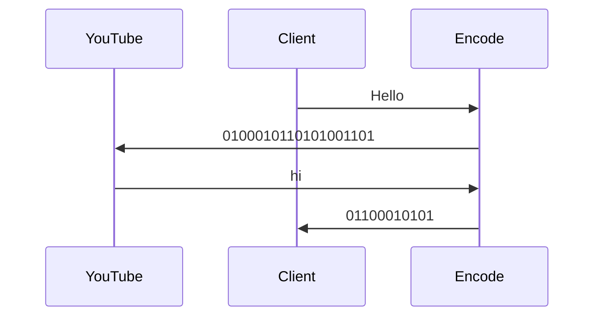
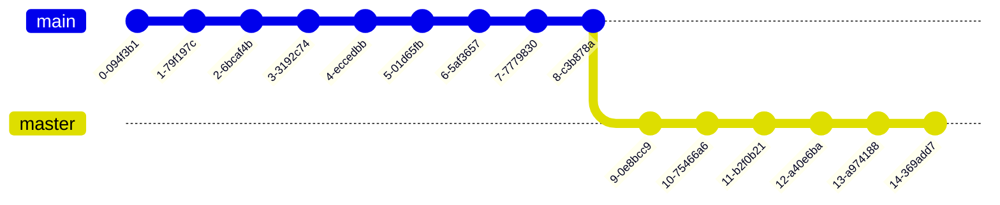

# VP Client
Create chat client to YouTube client use VP.h
# Content Example

```mermaid
sequenceDiagram
    participant YouTube
    participant Client
participant Encode
Client->>Encode: Hello
Encode->>YouTube: 0100010110101001101
YouTube->>Encode: hi
Encode->>Client: 01100010101
```
## Stats of graph

```mermaid 
gitGraph
commit
commit
commit
commit
commit
commit
commit
commit
commit
branch master
commit
commit
commit
commit
commit
commit
```
